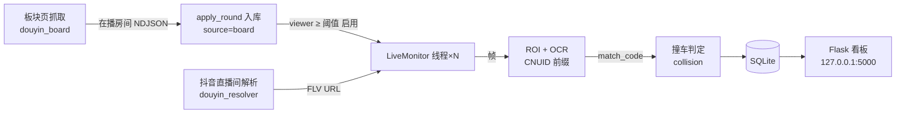

# 三角洲行动主播撞车监测

本地部署的多路直播监控系统：自动发现抖音「三角洲行动」板块里的高人气主播，对每一路在播画面做 ROI/OCR，识别左上角对局代码（CNUID 防盗水印），当**两个不同主播在同一时间窗口进入同一局**时判定为「撞车」事件，全部数据落 SQLite，通过 localhost Web 看板实时展示。

**MVP 边界**：本阶段只做取流适配、对局码识别、多路撞车判定、落库与运营面板。录制、授权状态机、自动出片/发布均留到 V1，**MVP 不会启动录制或发布**。

## 功能

- **板块自动发现**：定时抓取抖音板块页在播房间（`[discovery]`），全部登记入库；人气 ≥ `min_viewers` 的房间自动启用 OCR 监控；连续 `miss_limit` 轮不在板块即停用（历史行保留）。
- **高分主播监控**：每路启用主播一条常驻线程，自行完成「解析 → 直播监控 → 断流同 URL 重开 → 离线指数退避 → 重查」的循环。
- **对局码识别**：按抖音 CNUID 水印的**稳定前缀**比对（剔除末尾 12 位分钟时间戳，跨分钟翻转识别键不变）；通用短码支持整串正则。
- **撞车判定**：同一对局码在两个不同主播的活跃会话中出现且落在重叠窗口内 ⇒ 生成撞车事件；同一直播间的崩溃残留/断流重开会话**永远不会**误判为撞车。
- **Web 看板**：表格化展示主播状态/人气/当前局代码，只看直播中的主播，每 5 秒自动刷新；提供 JSON API。
- **逐路隔离**：每路主播独立的拉流器与 OCR 状态，单个主播解析失败/断流不影响其它主播。

## 数据流



## 项目结构

```
samegame/
  __main__.py          CLI 入口：seed → 板块发现线程 + 监控 worker + Flask
  config.py            TOML 加载（[app]/[ocr]/[discovery]/[[streamers]]/[platforms.*]）
  db.py                SQLite schema、自动迁移、seed（只清理/停用 manual 行）
  collector.py         StreamResolver 抽象、StreamlinkResolver 子进程解析、fetch_board
  douyin_resolver.py   抖音取流 CLI：Playwright 有头拦截 enter 接口取 FLV
  douyin_board.py      抖音板块 CLI：Playwright 偷听列表 JSON，DOM 兜底
  discovery.py         apply_round 纯函数 + DiscoveryService 定时抓板块
  monitor.py           LiveMonitor：每路主播常驻线程状态机
  capture.py           OpenCV 拉流（stream/camera/file），调高 FFmpeg 读取重试上限
  ocr.py               FrameOCR(ROI) + MatchCodeRecognizer（CNUID 前缀比对）
  collision.py         同码窗口期撞车判定（过滤同主播会话）
  web.py               Flask 应用与 API
  templates/index.html 运营看板
tests/
  test_core.py         核心回归（含撞车/孤儿会话用例）
  test_discovery.py    板块 round 同步逻辑
```

## 运行

1. 安装 Python 3.12+。
2. `py -3.12 -m venv .venv; .venv\Scripts\Activate.ps1`
3. `pip install -e ".[dev,vision]"`（仅跑模拟/面板可 `pip install -e .`）
4. 复制 `config.example.toml` 为 `config.toml` 并按需填写。
5. `python -m samegame --config config.toml`
6. 浏览器打开 http://127.0.0.1:5000 （默认仅绑定 localhost）。

> 跑抖音取流/板块抓取还需 `pip install playwright` + `playwright install chromium`（与 `douyin_resolver.py` / `douyin_board.py` 同进程解释器）。

## 配置（config.toml）

```toml
[app]
database = "samegame.sqlite3"
host = "127.0.0.1"
port = 5000
sample_interval_sec = 2      # 拉帧采样间隔
code_poll_interval_sec = 45  # 同码续期检查间隔
confirmation_frames = 1      # 1 帧有效解析即确认；面板有噪声行可调 2~3
overlap_window_sec = 300     # 撞车判定的首见时间窗口
url_ttl_sec = 900            # 拉流 URL 有效期（抖音 FLV 约 15 分钟）
reopen_max = 5               # URL 未过期时最多同 URL 重开次数
offline_backoff_base_sec = 30   # 未开播重查退避 base
offline_backoff_max_sec = 300   # 退避上限
stream_end_retry_sec = 15       # 下播/断流后短等待重查
log_level = "INFO"           # 日志为单行 JSON 结构化输出

[ocr]
# ROI 支持绝对像素 [x,y,w,h] 或 [0,1] 相对比例（自动适配分辨率）。
# 抖音对局码在画面左上角最顶部，1080p 实测相对 x≈1%~19%、y≈0.6%~2.4%。
roi = [0.005, 0.004, 0.20, 0.024]
# pattern 仅用于非 CNUID 通用短码的整串匹配。
pattern = "^CNUID[0-9]{33}$"
missing_alert_frames = 30

[discovery]
board_url = "https://live.douyin.com/categorynew/4_103_1_1_1_1011032"  # 留空 = 关闭板块发现
min_viewers = 10000    # 人气 >= 此值才启用 OCR 监控
interval_sec = 180     # 两轮抓取间隔
scrolls = 8            # 板块页滚动次数（触发懒加载）
miss_limit = 2         # 连续 N 轮不在板块 => 停用监控（保留历史）

[[streamers]]          # 手工监控的主播（与板块自动发现的并存）
platform = "douyin"
room_id = "401970645456"
name = "某主播"
monitor_enabled = true
priority = 5
url = "https://live.douyin.com/401970645456"
capture_source = "stream"   # stream / camera / file
capture_input = ""

[platforms.douyin]
# 解析命令，stdout 输出一行可播放 URL；{url} 替换为直播间 URL。
# 抖音用仓库自带解析器（见下节）；留空则回退 streamlink 插件。
resolver_command = ""
```

`[[streamers]]` 支持 `camera`（填 OBS 虚拟摄像头编号）与 `file`（本地视频）用于离线测试：

```toml
# capture_source = "camera"
# capture_input = 0
# capture_source = "file"
# capture_input = "test_data/live.mp4"
```

## 抖音接入

抖音对非浏览器请求会弹验证码中间页，streamlink 纯 HTTP 插件已失效。仓库提供两个 Playwright 有头浏览器工具（与人工过验证码的持久化 profile 配套）：

```powershell
# 直播间取流：拦截 /webcast/room/web/enter/ 接口，取 FLV（FULL_HD1→HD1→SD1 降级）
.\.venv\Scripts\python.exe samegame/douyin_resolver.py {url}

# 板块在播房间：偷听列表 JSON 接口（web_rid/昵称/人气），抓不到再用 DOM 兜底
.\.venv\Scripts\python.exe -m samegame.douyin_board <板块URL> [scrolls]
```

- 两者共用持久化浏览器 profile（仓库根目录 `.douyin_profile`）。**首次运行若弹验证码，浏览器窗口会自动移到屏幕中央，请手动完成一次滑块验证**；cookie 落盘后复用同一 profile 通常不再触发。
- 有头模式窗口默认移到屏幕外并最小化静音，避免每次解析弹出直播画面。
- 抖音对同一 IP 的并发浏览器会触发风控：解析与板块抓取都受同一把**串行锁**（`StreamlinkResolver._douyin_lock`）保护，任意时刻只有一个抖音浏览器实例。
- 子进程输出约定：成功 = 一行可播放 URL、退出码 0；明确未开播 = 一行 `__OFFLINE__`、退出码 0（视为正常，不重试）；失败 = 无 stdout、非 0 退出码。

没有可用解析器时记录结构化错误并继续监控其它主播；平台解析器可整体替换而不改业务代码。项目不包含爬虫、签名算法或非官方战绩 API。

## 撞车判定口径

1. 每路活跃会话持续 OCR；识别键 = CNUID 数字串**去掉末尾 12 位分钟时间戳的稳定前段**（同局标识）。`CN UID:<prefix>_<yyyymmddHHMM>` 中的时间戳每分钟跳变、且同一分钟对所有直播间都相同，没有对局判别力，故不进入比对/存储键。
2. 两个**不同主播**的活跃会话出现相同对局码，且首见时间差 ≤ `overlap_window_sec` ⇒ 生成 `collision_events`（open）。
3. 同一主播的多个会话（崩溃残留/断流重开/重启孤儿）永不互判撞车。

## 看板与 API

页面 http://127.0.0.1:5000/：

- **监控主播**：三列表格（主播名字 / 观看人数 / 当前局代码），默认只显示直播中（`online`）的主播并按人气降序；状态徽标含 直播中 / 正在连接 / 重连中 / 等待开播 / 未直播。
- **撞车事件**：最近 100 条，含事件对局码与参与主播。
- **素材清单**：整局录制已按决策后移至 V1，此区块固定提示无素材。

| 接口 | 说明 |
| --- | --- |
| `GET /api/streamers` | 主播全量行（含 `online`、`current_match_code`、人气等） |
| `GET /api/collisions` | 撞车事件最近 100 条（含参与主播名聚合） |
| `GET /api/materials` | V1 预留，固定返回 `deferred_to_v1` |
| `POST /api/observations` | 外部注入对局码（测试/模拟器用）：`{platform, room_id, name, code, ...}` |

监控线程与 Flask 刻意隔离——任何路由异常都不会停掉监控与发现线程。

## 测试

```powershell
.\.venv\Scripts\python.exe -m pytest -q
```

核心逻辑（识别归一化、撞车判定、板块 round 同步）为纯函数，未安装 OpenCV/RapidOCR 也能跑测试与面板；生产识别建议安装 `.[vision]` 并按实际画面标定 ROI。
